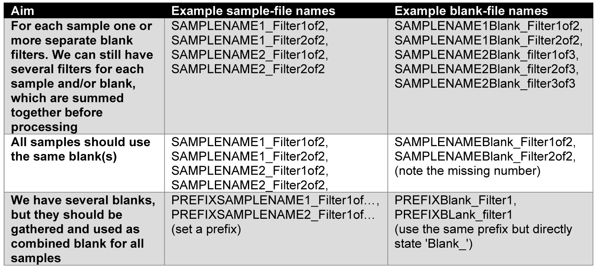

```{r, include = FALSE}
knitr::opts_chunk$set(
  collapse = TRUE,
  comment = "#>"
)
options(rmarkdown.html_vignette.check_title = FALSE)
```


# Installation
After the corresponding paper is published, you should be able to download this package from CRAN (watch the badge on the top of this page). Just go to the upper tool bar of your RStudio and click *tools* > *Install Packages...* > tipe in *easyCHAMP* > click *install*, or run:
```{r, eval = FALSE}
install.packages("easyCHAMP")
```


You can also install the development version of easyCHAMP from [GitHub](https://github.com/). If not already installed, you need to have Rtools installed on your system to be able to compile the development version *(https://cran.r-project.org/bin/windows/Rtools/)*.
(devtools only has to be installed once)

```{r, eval = FALSE}
install.packages("devtools") # just necessary if not already installed
devtools::install_github("Maki-science/easyCHAMP")
```
Once installed, you don't need to repeat this step each time! 
If you want to update to the newest version, just run the second line again.


# Naming & workflow
The (pre-)Purency workflow usually produces several filters (or measurements) for each sample. These are scanned via µ-FTIR and the resulting data is analysed with the Microplastic Finder of Purency. This software produces *.csv files for each sample containg all particles and their annotation, which is usually cured and refined by a human. Then, the files for each sample have to be corrected by blank results and summarized. And here is were we jump in:

We highly recommend to adopt a common file-naming procedure. The function uses everything of the .csv file names before the first '_' (underline) as sample name. The rest is considered as filter/measurement (e.g., SAMPLENAME_Filter1of3). This also allows for one blank for multiple filters/samples from one location (i.e., replicates), by naming the samples accordingly.

Here are some examples how to apply the naming for different blank application:


  
You can also use a mix of all those versions, if necessary, though, we think this might be a bad sampling design.
  
If you don't have any blanks to process, you can skip the blank processing with setting ```noBlank = TRUE```.

*Warning: The names should always be uniquely identifyable. For instance, having a blank called 'TESTBlank_filterx', and samples called 'TEST_filtery' and 'somethingelseTEST_filterz' would have a match for 'TEST' in both samples, even though they are thought be separately blank-corrected. Therefore, the 'test' is not clearly identifyable and the second sample should not include test, or the blank must be renamed more precisely.*

*WARNING: The naming of the files is an important prerequisite for a proper processing. Thus you need to cautiously set your file names!*

Put all files you want to process including their blank files into one folder. We recommend to put all files of a certain project/study or similar into one folder and process them at once.

# Processing possibilities
To use the package function, just load the package as usual:
```{r, eval = FALSE}
library(easyCHAMP)
```


## Processing a summary with blank correction
Now simply run the follwing line, but change the path accordingly to the location where you stored your files to be processed. Make sure to use (or change) ```/``` and not ```\```, since only windows uses backslashes. 

```{r , eval = FALSE}
easyCHAMP(path="C:/users/MYNAME/Desktop/MYFILESTOBEPROCESSED/") # or similar
```
*Note: The ```/``` in the end is required!*
Copy and paste this line into the console and press 'enter'.

*WARNING: This runs the function with its default configuration. You might need to adopt some further parameters. See below for details.*

*WARNING: Make sure that your .csv file has the correct column separator (; in default) and decimal sign (, in default). Otherwise read further below how to change it in the function, or make sure to save the .csv file properly.*

The function will warn you if there are missing values at some files. The respective files and columns are reported.
Once it finished the processing it will message that it is done.

### Output of easyCHAMP()
It will usually need just very few seconds to process e.g. 100 files, of course depending on the particle number. An excel file for each sample is created in the selected folder where the sample results are summarized. For all files there is one additional file with the processing data. There you can find data sets of each processing step on separate sheets (also raw data), so you can trace back the calculation and/or load parts of the data into R if required without running the whole function again.

For compatibility the Excel files are of an old version. Therefore, there might occur a message about potential broken file that you have to confirm. However, the warning can be ignored. 
*Note that the excel file will be coded with '.' as decimal sign!*


## Perform particle wise processing
In some cases it might be necessary to perform the processing and blank correction with a particle list, retaining the information about each single particle (compared to the size-class summary above). The aim here is, to keep each particle as such in the list, but still allow a correction for blank particles. 
Therefore, we created the second function ```easyCHAMP.particles()```. It mainly uses the area of each particle as size reference. In case of several blanks per sample, most similar particles across blank replicates will be averaged, while the blank correction is performed by searching the most similar particles within a certain range and then substract that particle from the list. This preserves each particle and its traits, e.g., for simulation purposes, while still allowing a rather conservative blank correction. Details are described below.

### How to use easyCHAMP.particles()
As before, simply load the library command after the package have been installed:
```{r}
library(easyCHAMP)
```

Make sure that the files are named according to your requirements for blank processing. The same rules apply as for ```easyCHAMP()``` (see above).

If no further requirements have to be fulfilled, the function can be run with just the path of the files to be processed as with the other function:
```{r, eval = FALSE}
easyCHAMP.particles(path="C:/users/MYNAME/Desktop/MYFILESTOBEPROCESSED/") # or similar
```

For further functionality, most of the parameters below can also be applied for this function.
However, in case of ```sizeclasses```, the function uses the squared value of each size class for categorization. This is because it seemed more intuitive to use simple edge lengths for the categorization, since a size class for an area of 22,500 (edge length of 150 µm) is rather abstract.

Further, the area of fibres is recalculated according to the manually measured actual length of fibres. Purencys' Microplastic Finder does not calculate the length of fibres correctly, since it just takes the distance from edge to edge. Changing angles are not considered, why the proper length is measured manually. As probably most suitable approximation of the real area of a fibre, this function multiplies the width by the actual (manually measured) length. This recalculated area can be found in the output file.

### Output of easyCHAMP.particles()
This function creates one .xls file, *processing_data.csv*. Here, you can find several sheets with the processed sample particles, processed blanks, removed sample and blank particles, and the raw sample and blank data. These data reflect each step of the processing. The sheets on removed particles include a column where it is stated, how the particle was processed (each particle gets an index to track each action of the function).
*Note that the excel file will be coded with '.' as decimal sign, as before!*


# Customization
There are a lot of possibilities to customize the function, the processing and the output. Check the options below or in the upper toolbar for further consideration.
*WARNING: some options are obligatory to be checked! Otherwise, the results might be not reliable! This covers especially the key words and column numbers that contain the required information* 


  * Get started:
    + [How to install](https://maki-science.github.io/easyCHAMP/articles/easyCHAMP.html#installation)
    + [How files should be named](https://maki-science.github.io/easyCHAMP/articles/easyCHAMP.html#naming-workflow)
    + [Two main processing ways](https://maki-science.github.io/easyCHAMP/articles/easyCHAMP.html#processing-possibilities)
      - [A polymer-shape-size wise summary](https://maki-science.github.io/easyCHAMP/articles/easyCHAMP.html#processing-a-summary-with-blank-correction)
      - [A particle-wise processing (mainly blank correction)](https://maki-science.github.io/easyCHAMP/articles/easyCHAMP.html#perform-particle-wise-processing)
  * Customisations:
    + [Labpresets & important function specifications](https://maki-science.github.io/easyCHAMP/articles/other-lab.html)
      - [Labpresets](https://maki-science.github.io/easyCHAMP/articles/other-lab.html#use-this-package-in-another-lab)
      - [specifications for function call according to your *.csv files](https://maki-science.github.io/easyCHAMP/articles/other-lab.html#how-to-specify-the-function-call-for-specific--csv-files)
    + [Customise file specifications](https://maki-science.github.io/easyCHAMP/articles/file-custom.html)
      - [Changing file specifications (e.g., decimal sign)](https://maki-science.github.io/easyCHAMP/articles/file-custom.html#changing-separator-and-decimal-sign-in--csv-files)
      - [Use different naming styles](https://maki-science.github.io/easyCHAMP/articles/file-custom.html#dont-use-the-recommended-file-naming)  
    + [Customise function options](https://maki-science.github.io/easyCHAMP/articles/option-custom.html)
      - [Change evaluated polymers (or other substances)](https://maki-science.github.io/easyCHAMP/articles/option-custom.html#change-evaluated-polymers)
      - [Change sizeclasses](https://maki-science.github.io/easyCHAMP/articles/option-custom.html#change-evaluated-size-classes)
      - [Not interested in particle shape?](https://maki-science.github.io/easyCHAMP/articles/option-custom.html#Not-interested-in-shape?)
      - [What if only parts of the samples are analysed?](https://maki-science.github.io/easyCHAMP/articles/option-custom.html#you-analysed-only-parts-of-a-sample---integrate-division-factors)
      - [*easyCHAMP.particles() only:* A certain particle colour should be analysed separately (e.g., using spiked standard particles)!](https://maki-science.github.io/easyCHAMP/articles/option-custom.html#one-colour-of-your-particles-should-be-separated-from-the-rest-easychamp-particles-only)
      - [*easyCHAMP.particles() only:* All particles have the same shape, I don't want to set it manually (or ignore it)!](https://maki-science.github.io/easyCHAMP/articles/option-custom.html#automatically-fill-missing-values-with-provided-default)
    + [Customise output options](https://maki-science.github.io/easyCHAMP/articles/output-custom.html)
      - [Get results into R environment for further use (e.g., creating graphs)](https://maki-science.github.io/easyCHAMP/articles/output-custom.html#keep-the-data-in-r-as-data-frame)
      - [How to get column sums in each file](https://maki-science.github.io/easyCHAMP/articles/output-custom.html#summary-of-each-column-at-the-bottom)
      - [How to get an extra file about the total particle numbers in each sample](https://maki-science.github.io/easyCHAMP/articles/output-custom.html#get-total-particle-numbers)
   * [Troubleshooting: a list of common issues and mistakes](https://maki-science.github.io/easyCHAMP/articles/troubleshooting.html#troubleshooting)
    
