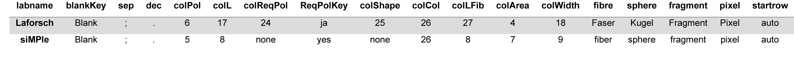

```{r, include = FALSE}
knitr::opts_chunk$set(
  collapse = TRUE,
  comment = "#>"
)
options(rmarkdown.html_vignette.check_title = FALSE)
```

## Use this package in another lab
The output of easyCHAMP can be customized to a certain extend and different labs may have different requirements and conventions on how to name things (also in the language this is done). Therefore, the default settings of this function apply for the animal ecology group of the University of Bayreuth. Unfortunately, there is no smart way to workaround. Thus, this function requires several parameters to preset the working environment of the lab.

To make it as generic and convenient to other labs working with this package, you can overwrite the default settings to your liking. In case you would prefer a complete preset for your lab, that you don't have to provide each parameter separately, we can implement a preset to your desire. Please feel free to open an [issue](https://github.com/Maki-science/easyCHAMP/issues) in order to request your own preset to become included in this package. A preset can be added quite fast.

A preset can be loaded in the function call by adding the parameter ```labpreset = "MYOWNLABNAME"```:
```{r , eval = FALSE}
easyCHAMP(path="C:/users/MYNAME/Desktop/MYFILESTOBEPROCESSED/", labpreset = "siMPle") # for example
```

### Current presets to choose



## How to specify the function call for specific *.csv files?
If no preset is available for your lab, so far, consider the following parameters to be adjusted (just add the necessary parameters as additional parameter in the function call):

  - ```colPol = 6```, Column number where the polymer type is stated. In the TOEKI lab this is column 6 (Class Name). Could also be provided as column name, but only in ASCII encoding (e.g., special character as . and ä = d).
  - ```colL = 17```, Column number for the particle length. In the TOEKI lab this is column 17 (Length [5µ]). Could also be provided as column name, but only in ASCII encoding (e.g., special character as . and ä = d).
  - ```colReqPol = 24```, Column number for the particle check, whether the particle is a polymer or not. In the TOEKI lab this is column 24 (Plastik? or Plastik ja/nein). Could also be provided as column name, but only in ASCII encoding (e.g., special character as . and ä = d). If no curing took place, this parameter could be set to 'none' which will cause the function to simply use all particles in the file. *Warning: this might cause further warnings or errors to occur, if a polymer is not an unknown substance (e.g., it is no polymer).*
  - ```ReqPolKey = "ja"```, key words that indicates whether it is a plastic particle or not in 'colReqPol'.
  - ```colShape = 25```, Column number for the particle shape. In the TOEKI lab this is column 25 (Form). Could also be provided as column name, but only in ASCII encoding (e.g., special character = . and ä = d). Can also be set to 'none' if no column for shape exists in the files. This will cause the function to create one and set as 'fragment' as shape. However, this can be ignored afterwards.
  - ```colCol = 26```, Column number for the particle color In the TOEKI lab this is column 26 (Farbe). Could also be provided as column name, but only in ASCII encoding (e.g., special character as . and ä = d).
  - ```colLFib = 27```, Column number for the particle length in case of a fibre with corrected length (because of curvy shape). In the TOEKI lab this is column 27 (Länge). Could also be provided as column name, but only in ASCII encoding (e.g., special character as . and ä = d).
  - ```fibre = "Faser"```, How fibres are called in colShape (Form). In the TOEKI lab it is 'Faser'.
  - ```sphere = "Kugel"```, How spheres are called in colShape (Form). In the TOEKI lab it is 'Kugel'.
  - ```fragment = "Fragment"```, How fragments are called in colShape (Form). In the TOEKI lab it is 'Fragment'.
  - ```pixel = "Pixel"```, How pixels are called in colShape (Form). In the TOEKI lab it is 'Pixel'.

I used column numbers here to workaround issues with special characters in some languages which R might has problems with. Numbers provide an unambiguous delimiter. However, we could use column names instead of numbers, as long as they are ASCII encoded or ASCII conform. Nonetheless, we would not recommend this, but rather use column numbers.

With an adopted preset, you can now run the function as mentioned before (just add the preset always to the function).
